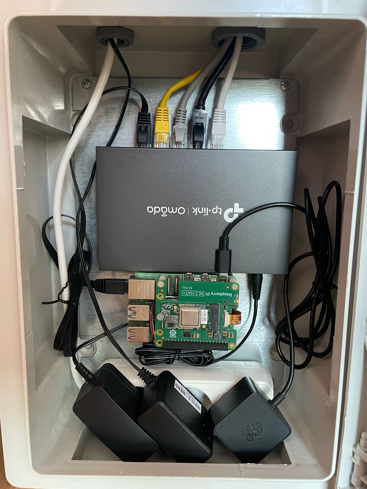
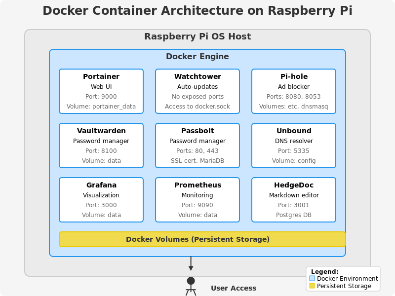

I'll create a comprehensive GitHub README file for this Docker Container Installer script for Raspberry Pi OS, along with an SVG diagram showing the container system architecture.

# Docker Container Installer for Raspberry Pi OS

A powerful and user-friendly script to simplify Docker installation and container management on Raspberry Pi devices.

## Raspberry Pi Setup Example


## Overview

This interactive bash script provides a convenient way to install Docker, Docker Compose, and multiple popular containerized applications on Raspberry Pi OS. The installer features an easy-to-use text-based UI powered by whiptail, making it accessible even for users with limited command-line experience.

## Features

- **One-click Docker Installation**: Automated installation of Docker Engine and Docker Compose
- **Container Selection**: Install and configure popular containers with a simple checkbox interface
- **Container Management**: Start, stop, restart, delete, and view logs of running containers
- **System Information**: View details about your Raspberry Pi and Docker environment
- **Log Tracking**: All operations are logged for troubleshooting
- **Secure Configuration**: Random password generation and secure storage of credentials

## Supported Containers

| Container | Description | Default Port |
|-----------|-------------|-------------|
| Portainer | Docker Web UI | 9000 |
| Watchtower | Automatic container updates | N/A |
| Pi.Alert | Network device detection | 80 |
| Pi-hole | Network-wide ad blocking | 8080/admin, 8053 (DNS) |
| Vaultwarden | Self-hosted Bitwarden server | 8100 |
| Passbolt | Open source password manager | 443 |
| Unbound | DNS resolver | 5335 |
| Grafana | Visualization & dashboards | 3000 |
| Prometheus | Monitoring & alerts | 9090 |
| HedgeDoc | Collaborative Markdown editor | 3001 |

## System Requirements

- Raspberry Pi (any model)
- Raspberry Pi OS (32-bit or 64-bit)
- Internet connection
- At least 2GB of available storage

## Installation

1. Clone this repository or download the script:
   ```bash
   git clone https://github.com/yourusername/docker-pi-installer.git
   cd docker-pi-installer
   ```

2. Make the script executable:
   ```bash
   chmod +x container_setup_https.sh
   ```

3. Run the script:
   ```bash
   ./container_setup_https.sh
   ```

## Usage

The script provides a text-based UI with the following main options:

1. **Install Docker & Docker Compose**: Automatically installs Docker and Docker Compose on your system
2. **Select & Install Containers**: Choose which containers to install from the supported list
3. **Manage Running Containers**: Start, stop, restart, remove containers or view their logs
4. **System Information**: Display system details about your Raspberry Pi and Docker environment
5. **About**: Information about the script

## Container Architecture



## Security Features

- **Password Generation**: Secure random passwords are generated for services that require them
- **Credential Storage**: Service credentials are stored in protected files with appropriate permissions
- **SSL Configuration**: Automatic SSL certificate generation for services that require HTTPS

## How It Works

The script performs the following operations:

1. **Environment Detection**: Identifies the Raspberry Pi model, architecture, and OS
2. **Dependency Installation**: Automatically installs required tools
3. **Docker Installation**: Uses the official Docker convenience script for proper installation
4. **Container Management**:
   - Creates appropriate Docker Compose files for selected containers
   - Sets up necessary directories and configurations
   - Manages container lifecycle (start, stop, restart)
   - Provides access to container logs

## Configuration Directory

The script creates a configuration directory at `/home/<username>/.docker-installer/` which contains:

- Docker Compose files for each container
- Generated credentials and passwords
- SSL certificates when needed

## Container Network Architecture

The default container setup segregates traffic appropriately:

- **Web interfaces** are typically exposed on different ports to avoid conflicts
- **DNS services** (Pi-hole, Unbound) are configured to work together if both are installed
- **Password managers** (Vaultwarden, Passbolt) run on separate ports with different security models
- **Monitoring stack** (Prometheus, Grafana) is pre-configured for integration


## License

This project is licensed under the MIT License - see the LICENSE file for details.

## Acknowledgments

- Thanks to the Docker community for the excellent container ecosystem
- Inspiration from various Raspberry Pi projects
- All the open-source projects that make self-hosting possible

---

*Note: Always review Docker Compose files before running containers in production environments, especially on devices accessible from the internet. Adjust ports, passwords, and security settings according to your specific needs.*

*Last Note: If pihole, passbolt or vaultwarden containers couldn't installed with intaller script then try to install using the given docker compose files and ssl certificate creation script*